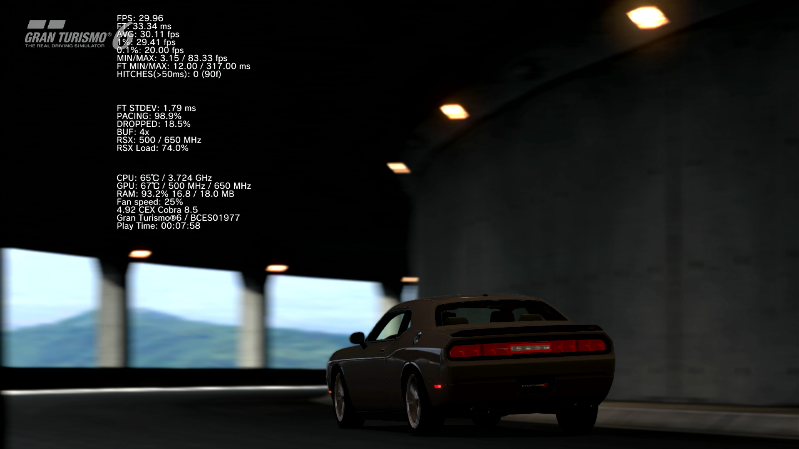

# VshFpsCounter

A VSH overlay that displays real in-game performance metrics. Unlike the original [VshFpsCounter](https://github.com/aldostools/webMAN-MOD/tree/master/_Projects_/VshFpsCounter) which reads FPS approximations from PAF, this fork measures actual frame timing directly from RSX hardware without touching the game's rendering pipeline.



[Demo Video](https://www.youtube.com/watch?v=Ut3g4BdBK_8)

---

## Architecture

Two PRX modules work together:

```
[Game Process]                         [VSH Process]
fps_sensor.sprx                        VshFpsCounter.sprx
     │                                       │
     │  polls cellGcmGetLastFlipTime()       │  reads lv2 shared memory
     │  -> computes frame timing             │  -> draws overlay via PAF
     │                                       │
     └──────── lv2 shared memory ────────────┘
               0x8000000000700100
               12 × 8-byte slots (96 bytes)
               written with poke (sc7)
               read with peek  (sc6)
```

### fps_sensor.sprx

A minimal C PRX injected into the game process by ps3mapi on game launch. It runs a single background thread that:

1. Polls `cellGcmGetLastFlipTime()` every 1ms. This returns the hardware microsecond timestamp of the last RSX buffer flip. No handler hooking, no state modification, completely non-invasive.
2. On each detected flip, records the delta into a 2048-entry ring buffer and updates an EMA for smooth instantaneous FPS.
3. Every 100ms, computes windowed statistics (3s window by default, configurable) and publishes all metrics to lv2 shared memory via a single `poke` syscall per slot.

Also collects on first flip detection:
- RSX core/memory clock speeds and VRAM size via `cellGcmGetConfiguration()`
- Display buffer IDs via `cellGcmGetCurrentDisplayBufferId()` to detect double/triple buffering
- VBlank count via `cellGcmGetVBlankCount()` for missed vsync tracking
- RSX command buffer `get`/`put` register gap for GPU busy %

The sensor never touches the game's flip handler, command buffer, or any rendering state.

### VshFpsCounter.sprx

The main module. It reads the shared memory the sensor wrote, computes the values, draws the overlay using PAF text widgets and creates logs if enabled.

---

## Metrics

| Metric | Source |
|---|---|
| FPS (instant) | Exponential moving average of hardware flip timestamps |
| FPS (avg) | Mean over configurable window (default 3s) |
| 1% low / 0.1% low | Session-wide frame time histogram percentiles |
| FPS min / max | Window extremes |
| Frame time (current, min, max) | From flip timestamp deltas |
| Frame time std dev | Single-pass variance from ring buffer |
| Frame pacing % | % of frames within ±2ms of target frame time |
| GPU busy % | RSX command buffer `get != put` sampling ratio |
| Dropped frame % | Missed vsyncs / total vsync opportunities |
| Hitch count | Frames exceeding configurable threshold (default 50ms) |
| Buffer count | Unique display buffer IDs seen (double/triple buffer) |
| RSX core / mem MHz | `cellGcmGetConfiguration()` read once |
| VRAM | `cellGcmGetConfiguration()` read once |

### GPU busy % (retail approach)

On retail hardware, RSX performance counters (`libgcm_pm`) are not available. They require a DECR/Tool system. Instead, the sensor reads the memory-mapped `CellGcmControl` registers via `cellGcmGetControlRegister()`:

- `get` RSX command processor read pointer
- `put` CPU write pointer (where the game last wrote commands)

When `get != put`, RSX is processing commands (busy). When `get == put`, RSX has consumed all commands and is waiting (idle or CPU-bound). Sampling this ratio every 1ms gives a reasonable GPU busy percentage without any pipeline interference.

### 1%/0.1% lows

Computed from a session-wide histogram rather than a sliding window. This matches how tools like RTSS/FrameView compute percentile lows. The sample pool grows over the session and gives increasingly accurate results. The windowed stats (avg, min, max, pacing) reset with the window; the percentile lows do not.

---

## IPC Protocol

LV2 shared memory at `0x8000000000700100`. 12 slots × 8 bytes = 96 bytes total.

| Slot | Offset | Contents |
|---|---|---|
| 0 | 0x00 | `[magic: FPS1][frame_count: u32]` |
| 1 | 0x08 | `[fps_instant: f32][frame_time_ms: f32]` |
| 2 | 0x10 | `[fps_avg: f32][fps_1_low: f32]` |
| 3 | 0x18 | `[fps_01_low: f32][fps_min: f32]` |
| 4 | 0x20 | `[fps_max: f32][ft_min_ms: f32]` |
| 5 | 0x28 | `[ft_max_ms: f32][hitch_count: u32]` |
| 6 | 0x30 | `[sample_count: u32][flags: u32]` |
| 7 | 0x38 | `[sensor_status: u32][buffer_count: u32]` |
| 8 | 0x40 | `[rsx_core_mhz: u32][rsx_mem_mhz: u32]` |
| 9 | 0x48 | `[vram_mb: u32][missed_vsyncs: u32]` |
| 10 | 0x50 | `[gpu_busy_pct: f32][dropped_pct: f32]` |
| 11 | 0x58 | `[ft_stdev_ms: f32][pacing_pct: f32]` |

---

## Configuration

The overlay is configured via YAML files placed in `/dev_hdd0/tmp/wm_res/VshFpsCounter/`.

### `VshFpsCounter.yaml` - overlay display

Controls what is shown and where. `version` must be `4` to enable the performance metric toggles.

`displayMode` controls which contexts show the overlay:
- `XMB` — XMB (home screen) only
- `GAME` — in-game only
- `XMB_GAME` — both (default)

Each context (`xmb`, `game`) has its own independent settings block with the same keys.

```yaml
version: 4

overlay:
  displayMode: XMB_GAME

  type:
    xmb:
      position: TOP_LEFT        # TOP_LEFT | TOP_RIGHT | BOTTOM_LEFT | BOTTOM_RIGHT
      textSize: 16.0
      temperatureType: CELSIUS  # CELSIUS | FAHRENHEIT | BOTH

      # System info
      showFPS: true
      showCpuInfo: true
      showGpuInfo: true
      showRamInfo: true
      showFanSpeed: true
      showClockSpeeds: true
      showFirmware: false
      showAppName: true
      showPlayTime: true

      # Performance metrics (version >= 4, require fps_sensor active)
      showFrameTime: true
      showAvgFPS: true
      showFps1Low: true
      showFps01Low: true
      showFpsMinMax: true
      showFrameTimeMinMax: true
      showFrameTimeStdev: true
      showPacing: true
      showDroppedFrames: true
      showHitches: true

    game:
      position: TOP_LEFT
      textSize: 16.0
      temperatureType: CELSIUS
      # ... same keys as xmb above
```

Performance metric keys (all default `true` when `version: 4`):

| Key | Shows |
|---|---|
| `showFrameTime` | Current frame time in ms |
| `showAvgFPS` | Average FPS over the sample window |
| `showFps1Low` | 1% low FPS (session-wide p99 frame time) |
| `showFps01Low` | 0.1% low FPS (session-wide p99.9 frame time) |
| `showFpsMinMax` | Min/max FPS over the sample window |
| `showFrameTimeMinMax` | Min/max frame time over the sample window |
| `showFrameTimeStdev` | Frame time standard deviation |
| `showPacing` | Frame pacing consistency % |
| `showDroppedFrames` | Dropped frame % (missed vsyncs) |
| `showHitches` | Hitch count (frames over threshold) |

### `VshFpsLogger.yaml` - session logging

Optional. If `enabled: true`, the plugin writes a `.csv` file to `/dev_hdd0/tmp/wm_res/VshFpsCounter/sessions/` at the start of each game session. A notification confirms the path.

```yaml
enabled: true

performance:
  windowMs: 3000          # sample retention window in ms (default 3000)
  updateIntervalMs: 1000  # how often derived metrics refresh in ms (default 1000)
  hitchThresholdMs: 50.0  # frame time threshold for hitch detection in ms (default 50)
```

If the file doesn't exist, logging is disabled. Fields missing or zero fall back to the defaults shown above.

---

## Session Logs

When logging is enabled, one CSV file is written per game session:

```
/dev_hdd0/tmp/wm_res/VshFpsCounter/sessions/BLUS12345_2026-04-01_18-30-00.csv
```

The file starts with a metadata comment line then a column header:

```
# BLUS12345 - Game Title - 2026/04/01 18:30:00
elapsed_s,fps,fps_avg,fps_1low,fps_01low,fps_min,fps_max,
ft_ms,ft_min_ms,ft_max_ms,ft_stdev_ms,
pacing_pct,dropped_pct,hitch_count,
cpu_temp,gpu_temp,fan_pct,
cpu_mhz,gpu_mhz,gddr3_mhz,
ram_used_mb,ram_total_mb
```

Temperatures are always in Celsius regardless of the display setting. Rows are buffered in memory (4 KB) and flushed to disk every 16 samples or at session end.

---

## Installation

1. Copy `VshFpsCounter.sprx` to `/dev_hdd0/wm_res/`
2. Copy `fps_sensor.sprx` to `/dev_hdd0/tmp/wm_res/VshFpsCounter/`

The sensor is injected into the game process automatically on game launch if the menu was opened in the XMB.

### Tree

In the end, your directory structure should look like this

```
/dev_hdd0/tmp/wm_res            <- webMAN resources
    VshFpsCounter.sprx          <- Main module
    VshFpsCounter/              <- Separate directory (create this folder)
        VshFpsLogger.yaml       <- Logger config
        VshFpsCounter.yaml      <- VSH menu config
        fps_sensor.sprx         <- Sensor module
```

---

## Building

- Visual Studio 2013+
- Sony PS3 SDK 4.75+

Build `FpsSensor` project first, then `RouLetteVshMenu`.

---

## Known Issues

Incompatible games or games that have issues:

* Skyrim 

If you have incompatible games you come across, please make an issue.

---

## Credits
- [@TheRouletteBoi](https://github.com/TheRouletteBoi/RouLetteVshMenu/) - original [VshFpsCounter]()
- [@Jordy-Nateur](https://github.com/Jordy-Nateur) - PAF classes and VSH-Playground
